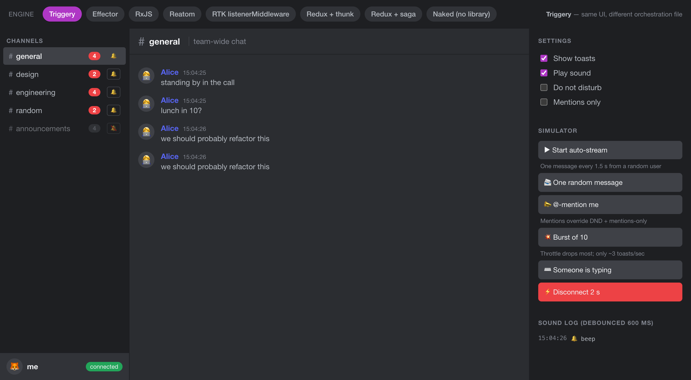
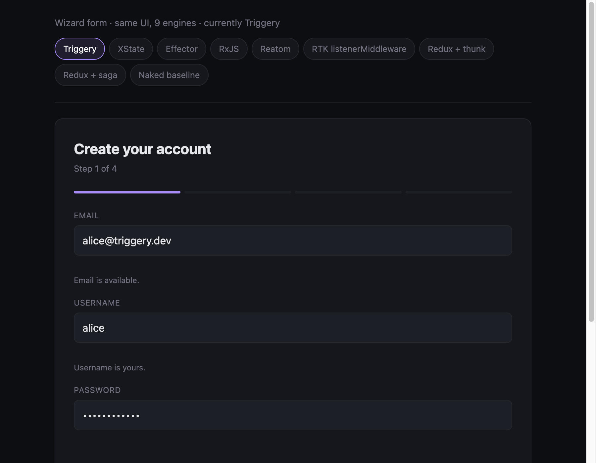

# Triggery Comparisons

Side-by-side, honest comparisons of orchestration libraries on identical real-world scenarios.

> Every scenario in this repo is **one app with N implementations** — same UI, same domain types, same acceptance behaviour. The only thing that changes between implementations is the file in `engines/<library>.ts`. That's the apples-to-apples line.

## Scenarios

| Scenario | Status | Libraries compared |
|---|---|---|
| [`notifications-pipeline`](./notifications-pipeline) | ✅ shipped | triggery · effector · rxjs · reatom · RTK listenerMiddleware · redux-thunk · redux-saga · naked baseline |
| [`wizard-form`](./wizard-form) | ✅ shipped | + xstate (9 implementations total) |
| [`floating-workspace`](./floating-workspace) | ✅ shipped | 9 engines — IDE-like window manager: tree-based tiling + per-panel mode toggle + panel-to-panel snap + live inspectors + modals + keyboard |

### Preview _(wip)_

<table>
<tr>
<td width="33%" align="center"><a href="./notifications-pipeline"></a></td>
<td width="33%" align="center"><a href="./wizard-form"></a></td>
<td width="33%" align="center"><a href="./floating-workspace"></a></td>
</tr>
<tr>
<td align="center"><a href="./notifications-pipeline"><b>notifications-pipeline</b></a></td>
<td align="center"><a href="./wizard-form"><b>wizard-form</b></a></td>
<td align="center"><a href="./floating-workspace"><b>floating-workspace</b></a></td>
</tr>
</table>

More to come (`debounced-search`, others). PRs welcome.

## Headline results

Two scenarios shipped so far. They probe different shapes of the same problem space — **event-driven side-effects** (notifications) and **multi-step state + per-field async** (wizard) — and the leaderboard reshuffles between them on purpose. Each scenario's full numbers + narrative live in its own README.

### [`notifications-pipeline`](./notifications-pipeline) — 15 rules, gating + throttle + debounce + fan-out

| axis | leader | triggery |
|---|---|---|
| **LOC** | **triggery — 162** (after naked 142) | **1st** of libraries |
| **API surface** | **triggery — 1 import / 2 symbols** | **1st** |
| **Bundle (gzipped)** | reatom — 3.52 KB | 2nd (5.17 KB, half of effector/rxjs/redux-thunk) |
| **Throughput (sustained)** | **triggery (fireSync) — 275k op/sec** | **1st** (1.21× redux-thunk, 4.2× rtk) |
| **Latency p50 (single ev.)** | rxjs — 0.25 µs | 3rd (1.5 µs fireSync) |
| **Scaling cost (adding R15)** | reatom / rtk — +5 LOC | tied at +6 |

### [`wizard-form`](./wizard-form) — multi-step + 3 async-validated fields + branching

| axis | leader | triggery |
|---|---|---|
| **LOC** | **triggery — 190** (-6 under naked baseline 196) | **1st** (+11 vs reatom, +186 vs xstate) |
| **API surface** | **triggery — 1 import / 2 symbols** | **1st** |
| **Cyclomatic complexity** | **triggery — 28** | **1st** |
| **Bundle (gzipped)** | reatom — 4.44 KB | 2nd (6.08 KB) |
| **Throughput (setField)** | rxjs — 358k op/sec | 4th (177k) |
| **Latency p50** | reatom — 2.1 µs | 3rd (2.5 µs) |
| **Scaling (+2 async fields)** | effector — +40; **triggery — +27** | best-of-the-rest |

### [`floating-workspace`](./floating-workspace) — IDE-like window manager (tree tiling + floating + modals)

| axis | leader | triggery |
|---|---|---|
| **LOC** | redux-thunk — 168 *(+ 202 shared slice)* | **best non-redux** (295 — single file) |
| **API surface** | **triggery / effector — 2 symbols** *(tied)* | **1st** *(tied)* |
| **Bundle (gzipped)** | naked — 4.25 KB | 3rd (8.13 KB — beats redux trio + rxjs + xstate) |
| **Dependency footprint** | naked — 0 packages | **tied 2nd** *(1 package)* |
| **Drag throughput** | naked — 10.6M ev/sec *(throttle-honoring)* | 6th (2.26M — closure-throttle + transient-stream bypass) |
| **Latency p50** | naked — 0.54 µs | 4th (3.1 µs) |
| **Cyclomatic complexity** | redux-saga — 32 *(slice excluded)* | **best non-redux** (88) |

> **Same library, different scenarios.** Triggery wins LOC + API surface + cyclomatic in wizard-form and bundle/API + deps in notifications-pipeline. In floating-workspace **it wins single-file LOC (295) and cyclomatic (88) among non-redux engines**, plus **API surface tied 1st, bundle 3rd, dependency footprint 1 package**. The trio of redux engines look small per-file only because they share a 202-LOC slice — count both files and they land at ≈ 370, above triggery. Drag throughput climbed 269k → 2.07M → 2.26M ev/sec across two passes: (1) closure-throttle at the call site instead of `actions.throttle` inside the trigger handler, then (2) the three transient-stream methods (`pointerMove`, `setCursor`, `setTileDropTarget`) bypass `runtime.fire('mutate')` entirely — direct state assign + emit. The bypass is semantically correct (those three update state nothing else reacts to and shouldn't trigger persist), not just faster. **Each scenario rewards a different mental model — that's the point.**

## What we measure

For each implementation we collect:

- **LOC** — non-comment, non-blank lines in the orchestration file only (UI is shared).
- **Bundle size** — engine-only, esbuild with the same target, minified + gzipped, `production` export condition.
- **Dependency footprint** — count + list of unique npm packages each engine drags into a production bundle (esbuild metafile, walked transitively, `react`/`react-dom` externalised).
- **Cyclomatic complexity** — `if`/`case`/`&&`/`||`/`?:` density in the engine file (proxy for "branching in your head while reading").
- **API surface** — unique imported symbols + count of primitive constructors used.
- **Throughput + latency** — `op/sec` of sustained dispatch and p50/p95/p99 single-event latency (Node 20 / M1 Pro; ±10-15% between runs).
- **Mental load** — a 4-axis subjective table (concepts / spec↔code distance / debug tooling / onboarding) backed by per-engine narrative. Subjective, not a number — but called out explicitly so it's findable.

Numbers live in each scenario's `measure/reports/` (regenerated by `pnpm measure`) and get rolled up into the scenario README.

## What this isn't

- ❌ **Not a microbenchmark.** Throughput on synthetic loops belongs in the [triggery benchmarks suite](https://github.com/triggeryjs/triggery/tree/main/benchmarks). Here we measure what users feel: code you write, code you ship.
- ❌ **Not a hit piece.** effector/rxjs/reatom/RTK are excellent libraries with their own strong scenarios — our point is to put scenarios side by side and let the reader see which mental model fits their problem.
- ❌ **Not vendored.** Each scenario depends on the published npm versions of every library, no monkey patches.

## Running a scenario

```bash
pnpm install
pnpm dev                 # opens notifications-pipeline
# → http://localhost:5180/?engine=triggery
# Try: ?engine=effector | rxjs | reatom | rtk | redux-thunk | redux-saga | naked
```

## Contributing a new comparison

1. Copy `notifications-pipeline/` to your scenario name.
2. Keep `src/types.ts` + `src/engine.ts` as the contract — UI talks only to that interface.
3. Add one `src/engines/<lib>.ts` per library.
4. Write a scenario `README.md` that explains the **acceptance behaviour** before any implementation detail.

The acceptance behaviour is the single most important section — once it's frozen in plain English, every implementation is a translation of the same English, not a different problem.

## Why a separate repo

We want comparisons to be:

- Honest — depends on published versions, not workspace links.
- Easy to grep — one library per file, contained.
- Free of the main repo's CI surface — no risk that `comparisons` blocks a triggery release.

The main project lives at <https://github.com/triggeryjs/triggery>.

## License

MIT. See [`LICENSE`](./LICENSE).
