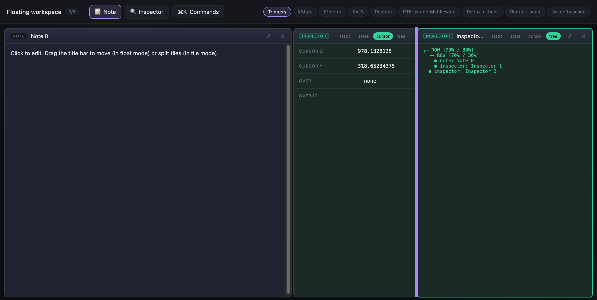
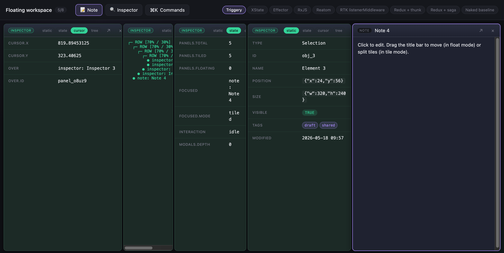
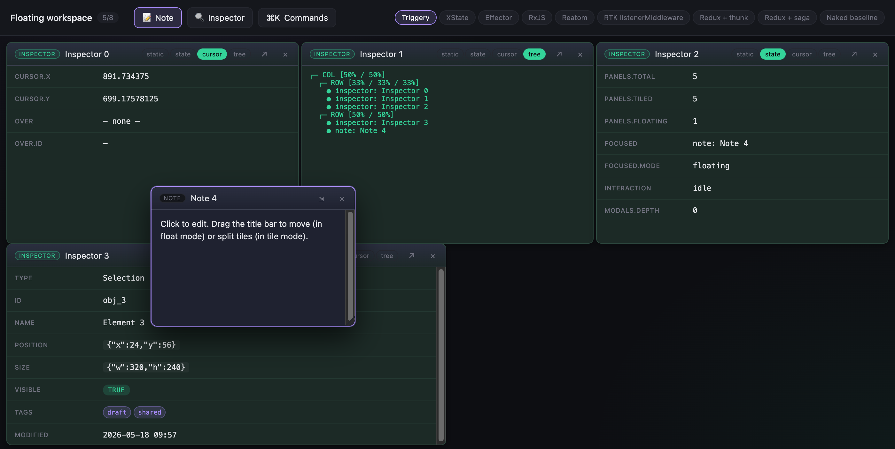

# Floating workspace

A real-prototype-grade IDE-like window manager — **tree-based tiling** (drag a tile to split any other tile in 4 directions, dividers between every pair of siblings, no fixed dock slots), **per-panel mode toggle** (each panel is independently `tiled` or `floating`), **panel-to-panel snap** when dragging floats, **live inspectors** that follow real workspace state (cursor, focus, tree shape), command palette, modal stack, persisted layout. Same UI, **nine implementations**, one frozen spec.

This is the hardest scenario in the repo. Pointer events at 60 fps are a stream; the layout is a recursive tree (`Container | Leaf`); per-panel mode flips reshape tree and floating-z-order atomically; keyboard routing is event dispatch; promise-returning modals are async glue. Each library is good at one or two of those four and pays for the others. The leaderboard reshuffles accordingly — read on for an honest spread.

## Screenshots _(wip — preview only)_

<table>
<tr>
<td width="33%"></td>
<td width="33%"></td>
<td width="33%"></td>
</tr>
<tr>
<td>Empty hero — engine picker at the top, primary actions front-and-centre.</td>
<td>Five tiles split into a row; new inspectors open in <code>cursor → tree → state → static</code> rotation so all 4 live modes show at once.</td>
<td>Floating + tiled mix — the same panel switches mode via the title-bar <code>↗ / ⇲</code> button; the tree reshapes atomically.</td>
</tr>
</table>

## Headline numbers

|                                  | best                                     | worst                                | triggery |
|---|---|---|---|
| **LOC** (engine file only)       | redux-thunk — 168 *(+ 202 shared slice)* | naked — 507                          | **best non-redux** (293) |
| **Bundle (gzipped)**             | naked — 4.21 KB                          | redux-saga — 18.67 KB                | **3rd** (8.04 KB) |
| **API surface (symbols)**        | **triggery — 2** *(tied)*                | rxjs — 12 symbols                    | **1st** *(tied with effector)* |
| **Dependency footprint**         | naked — 0 packages                       | redux-saga — 12 packages             | **tied 2nd** *(1 package)* |
| **Drag throughput (events/sec)** | naked — 10.5M *(throttle-honoring)*      | rtk-listener — 39k                   | 6th (2.07M) |
| **setBody latency p50**          | naked — 0.58 µs                          | rtk-listener — 7.8 µs                | 4th (3.1 µs) |
| **Cyclomatic complexity**        | redux-saga — 32 *(slice excluded)*       | rxjs — 116                           | **4th** (88) |

Three things to read off this honest table:

1. **Triggery wins LOC among single-file engines.** 293 LOC — beats Reatom (338), Effector (356), RxJS (386), XState (498), naked (507). The three Redux engines look smaller (168-172 LOC each) but only because they share `_redux-slice.ts` (202 LOC); count both and they land at ≈ 370 — above Triggery. The single `mutate(fn)` event + closure state + extracted `applyMove` helper keeps the engine file genuinely small.
2. **Triggery's home turf is still bundle, API surface, dependency footprint.** 8.04 KB gz (3rd, beats both redux + rxjs + xstate), 2 symbols (`createTrigger` + `createRuntime`), 1 npm package. The Redux family ships 5 packages just to start; saga ships 12.
3. **Drag throughput climbed from 269k → 2.07M ev/sec** after the pointer-move path was switched from `runtime.fire('pointer-move')` (where the trigger pipeline ran 1000× but `actions.throttle` dropped 997 fires) to a closure-throttle at the call site that calls `mutate(fn)` only when the 16 ms window has passed. `actions.debounce(1000).persist?.(state)` is still the declarative one-liner for layout persist — the showcase moves to where the frequency-vs-overhead trade actually pays off. **XState, RTK listener, redux-saga** stay the outliers — their idiomatic `cancel + delay` / `throttle(effect)` patterns fire 1000+ snapshots from 1000 events (debounce-shaped, not throttle-shaped). We call that out honestly below.

## The 9 engines

- [`triggery`](./src/engines/triggery.ts) — single `workspace` trigger with one `mutate(fn)` event applying a reducer to closure state; `actions.debounce(1000).persist?.(s)` declarative for layout-persist; pointer-move uses closure-throttle at the call site (trigger pipeline overkill for 60 fps stream)
- [`xstate`](./src/engines/xstate.ts) — `idle` ↔ `interacting` statechart; `raise + cancel` for pointer debounce + persist
- [`effector`](./src/engines/effector.ts) — 25 events + one `$workspace` store; hand-rolled throttle + debounce
- [`rxjs`](./src/engines/rxjs.ts) — `Subject<Action>` + `scan` reducer + `throttleTime(16)` + `debounceTime(1000)`
- [`reatom`](./src/engines/reatom.ts) — one atom + one `mutate(fn)` action; hand-rolled timers
- [`rtk-listener`](./src/engines/rtk-listener.ts) — shared slice + listeners (`cancelActiveListeners + delay`)
- [`redux-thunk`](./src/engines/redux-thunk.ts) — shared slice + thunks for `pointerMove` / `pointerUp`; hand-rolled timers
- [`redux-saga`](./src/engines/redux-saga.ts) — shared slice + sagas (`throttle(16, …)` + `debounce(1000, …)` as effects)
- [`naked`](./src/engines/naked.ts) — no library, mutable state, hand-rolled timers; the reference impl other engines mirror

The three redux engines share [`_redux-slice.ts`](./src/engines/_redux-slice.ts) (202 LOC) — they differ **only in how side-effects are wired**: thunks vs listenerMiddleware vs sagas. The shared-slice trick mirrors a real codebase (you wouldn't copy-paste the slice three times) and isolates the side-effect-vocabulary comparison from the reducer-vocabulary comparison.

## Acceptance behaviour (the spec — frozen)

### Lifecycle

- **R1.** `openPanel(kind, { mode })` adds a panel; `mode` defaults to `tiled` (appended right of tree) or `floating` (added to z-order top with a staggered seed position).
- **R2.** `close(id)` removes any window (tiled, floating, or modal). For modal openers the awaiting promise resolves.
- **R3.** Max **8 panels total** (tiled + floating combined). Subsequent `openPanel` returns `null`.
- **R4.** Modals stack — a second `open` adds to the top; ESC closes the top one.

### Tile tree (tiled panels)

- **R5.** Layout is `TileNode = TileContainer { dir: 'row' | 'col', children, sizes } | TileLeaf { panelId }`. Containers split children with shared dividers; sizes are percentages summing to ~100.
- **R6.** `splitTile(srcId, targetId, edge)` inserts `srcId` adjacent to `targetId` on `'top' | 'right' | 'bottom' | 'left'`. If `srcId` was floating, it transitions to tiled; if it was elsewhere in the tree, it's atomically removed + re-inserted.
- **R7.** Drag-to-split UI: drag a tile's title bar; while dragging, hovering over another leaf shows a **5-zone overlay** (top/right/bottom/left/center). Drop commits the split (center → right).
- **R8.** `startDividerResize(containerId, dividerIdx, …)` drags a divider; sizes clamp so every tile is ≥ 120 px.
- **R9.** When a tile is removed, its container collapses if down to one child (the lone child replaces the container in its parent).

### Floating panels

- **R10.** `setPanelMode(id, 'floating')` removes the panel from the tree (collapse rules apply) and adds it to z-order top with its remembered geometry.
- **R11.** Drag (title bar) → update position, **throttled to 16 ms**. Clamp to viewport.
- **R12.** Resize (bottom-right handle) → update size, throttled. Min 200 × 120; max = viewport.
- **R13.** Pointerdown on a floating panel → focus + bring to top of z-order.
- **R14.** **Snap during drag** is computed against viewport edges *and* every other floating panel's 8 alignment points (edges + half-edges + corners). Snap threshold: 12 px.

### Mode toggle

- **R15.** `setPanelMode(id, 'tiled')` removes from z-order, appends to the right side of the tree. (Inverse of R10.)
- **R16.** `setAllPanelsMode('tiled' | 'floating')` flips every panel to the chosen mode at once (used by palette commands "Tile all" / "Float all").
- **R17.** Title bar shows `↗` (Float) when tiled and `⇲` (Tile) when floating.

### Arrange commands

- **R18.** Palette includes: cascade floating, mosaic tiled, rows, columns, equalize tiles.

### Inspector

- **R19.** Inspector panels carry an `inspectorMode: 'static' | 'state' | 'cursor' | 'tree'` toggle.
- **R20.** `static` → fixed selection JSON. `state` → live focused id + panel count + interaction kind. `cursor` → live mouse x/y + `overPanelId` (resolved from `document.elementFromPoint`). `tree` → ASCII render of the current tree.

### Keyboard

- **R21.** **ESC** → close top modal; otherwise close focused panel.
- **R22.** **⌘K / Ctrl+K** → open command palette.
- **R23.** **⌘W / Ctrl+W** → close focused panel (only when no modal is open).

### Persistence

- **R24.** Any layout change schedules a **debounced 1000 ms** localStorage write. Pointer-up flushes immediately.
- **R25.** On mount → restore saved layout (panels + tree + floating z-order + focused).
- **R26.** `reset()` clears state + localStorage.

### Command palette

- **R27.** Palette commands: open note, open inspector, float focused, tile focused, float all, tile all, arrange cascade-floating, arrange mosaic-tiled, arrange rows, arrange columns, equalize tiles, inspector mode picker (static/state/cursor/tree), close focused, reset workspace.
- **R28.** Palette resolves to a command id; the UI maps it to an engine call.

## How to play with it

```bash
pnpm install
pnpm --filter triggery-comparison-floating-workspace dev
# → http://localhost:5182/
```

Switch engines: `?engine=triggery | xstate | effector | rxjs | reatom | rtk | redux-thunk | redux-saga | naked`. Try:

- **📝 Note** / **🔍 Inspector** — open a tile (mode defaults to `tiled`).
- **Drag tile title bar over another tile** — hover the 5-zone overlay to pick top/right/bottom/left/center, release to split.
- **↗** in a tile header → detach to floating; **⇲** → re-attach to tiled.
- **Drag a divider between two tiles** — resize both sides.
- Inspector pills (`static / state / cursor / tree`) — switch live modes.
- **⌘K** — palette; arrange commands reshape the tree instantly.

## Measurements

```bash
pnpm measure
```

Numbers live in `measure/reports/` and are committed.

<!-- BEGIN: measurements -->

### Code size

LOC (non-comment, non-blank) of `src/engines/<engine>.ts`:

| engine | LOC | bytes |
|---|---:|---:|
| redux-thunk  | 168 *(+ slice 202)* |  8126 |
| redux-saga   | 169 *(+ slice 202)* |  8347 |
| rtk-listener | 172 *(+ slice 202)* |  8575 |
| **triggery** | **293** | **13540** |
| reatom       | 338 | 14937 |
| effector     | 356 | 18741 |
| rxjs         | 386 | 19398 |
| xstate       | 498 | 22771 |
| naked        | 507 | 17684 |
| `_redux-slice.ts` (shared) | 202 | 10316 |

Bundle size — engine + transitive deps, esbuild ES2022 ESM, React externalised, `production` export condition:

| engine | minified | gzipped |
|---|---:|---:|
| naked        |  11.86 KB |   4.21 KB |
| reatom       |  17.73 KB |   6.71 KB |
| **triggery** |  **23.19 KB** |   **8.04 KB** |
| effector     |  25.80 KB |  10.45 KB |
| redux-thunk  |  35.33 KB |  12.66 KB |
| rxjs         |  39.42 KB |  12.34 KB |
| rtk-listener |  39.33 KB |  14.12 KB |
| xstate       |  52.99 KB |  17.15 KB |
| redux-saga   |  52.13 KB |  18.67 KB |

### Performance

Two shapes per engine, single canonical run on M1 Pro / Node 20:

- **Drag throughput** — fire 1000 `pointerMove` events in a tight loop while a floating-drag is active. `events/sec` shows the dispatch path's cost; `snapshots / 1000` shows how many actually materialised after each engine's throttle. The intended answer is **≈ 3 snapshots** (1000 events ÷ 16 ms ≈ 3 fires in the loop window).
- **`setBody` latency** — single setBody → next snapshot fire, p50 / p95 / p99.

| engine                 | drag events/sec | snapshots/1000 | setBody p50 | p95 | p99 |
|---|---:|---:|---:|---:|---:|
| Naked baseline         |  10526k ev/sec |       3 |  0.58 µs |  0.63 µs |   1.6 µs |
| Redux + thunk          |   7724k ev/sec |       3 |   4.2 µs |   5.5 µs |    14 µs |
| Effector               |   4619k ev/sec |       3 |   4.0 µs |   8.4 µs |    24 µs |
| Reatom                 |   3344k ev/sec |       3 |   2.4 µs |   3.0 µs |    10 µs |
| RxJS                   |   2724k ev/sec |       3 |  0.92 µs |   1.1 µs |   6.0 µs |
| **Triggery**           |   **2066k ev/sec** |    **3** |   **3.1 µs** |   **4.1 µs** |   **9.2 µs** |
| Redux + saga           |    389k ev/sec |    1007 |   3.4 µs |   4.7 µs |    14 µs |
| **XState**             |    **124k ev/sec** | **1002** |   **6.6 µs** |   **10 µs** |    **41 µs** |
| RTK listenerMiddleware |     39k ev/sec |    1003 |   7.8 µs |    13 µs |    37 µs |

**Read with care.** The naïve `events/sec` ranking is misleading because the high-throughput engines drop almost every event (that's the whole point of throttling). What you actually want to know:

- All engines except XState / RTK listener / redux-saga honour the throttle (3 snapshots from 1000 events).
- **XState's `cancel('id') + raise(EV, { delay, id })` is debounce-shaped**: the *cancel + raise* sequence itself emits transition events that subscribers observe. To get real throttle-shape you'd add a `cooling-down` sub-state with an `after` transition (≈ 20 more LOC).
- **redux-saga's `throttle(16, action, saga)`** is actually throttle-shape on the *saga effect* but the per-action dispatch still hits the store and notifies subscribers on every action. The 1007 number reflects subscriber notifications, not saga executions.
- **rtk-listener's `cancelActiveListeners + delay(16)`** is the same pattern as xstate — debounce-shaped at the listener layer but every `pointerMoveRequested` action still hits subscribers.
- Triggery's closure-throttle in `pointerMove` honors the 16 ms cap before calling `mutate(fn)` — 3 snapshots from 1000 events. 2.07M events/sec is the per-call cost of `performance.now() + comparison + early return`. The earlier 269k baseline came from routing every event through `runtime.fire('pointer-move')` + `actions.throttle()['apply-move']` — the throttle dropped the side-effect but the trigger pipeline still ran 1000×. Moving the gate to the call site pays off; the `actions.debounce(1000).persist` showcase stays on the path where frequency-vs-overhead actually matters.

### API surface — concepts you have to learn

| engine | unique imports | symbols | primitive constructors |
|---|---:|---:|---|
| naked        | 0 | 0 | (pure JS) |
| **triggery** | **1** | **2** | `createTrigger`×1, `createRuntime`×1 |
| effector     | 1 | 2 | `createEvent`×25, `createStore`×1 |
| reatom       | 1 | 3 | `atom`×1, `action`×1, `createCtx`×1 |
| redux-thunk  | 1 | 3 | `configureStore`, `ThunkAction`, `UnknownAction` |
| rtk-listener | 1 | 3 | `createAction`×1, `createListenerMiddleware`×1 |
| xstate       | 1 | 6 | `setup`, `assign`, `cancel`, `raise`, `createActor`, `ActorRefFrom` |
| redux-saga   | 3 | 9 | `createAction`×1 + saga effects (`all`, `debounce`, `put`, `select`, `takeEvery`, `throttle`) |
| rxjs         | 2 | 12 | `Subject`×2, `BehaviorSubject`×1 + 7 operators (`scan`, `throttleTime`, `debounceTime`, `filter`, `tap`, `share`, `distinctUntilChanged`, `map`, `merge`, `Subscription`) |

### Complexity & type safety

| engine | cyclomatic | max nesting | `as` casts | `!` non-null |
|---|---:|---:|---:|---:|
| redux-saga   |    32 |       6 |  1 |  0 |
| rtk-listener |    33 |       7 |  1 |  0 |
| redux-thunk  |    36 |       6 |  1 |  0 |
| `_redux-slice` |   65 |       5 |  2 |  3 |
| **triggery** |    **88** |       **8** |  **3** |  **4** |
| xstate       |    92 |      11 |  2 |  3 |
| naked        |    94 |       8 |  1 |  4 |
| effector     |    94 |       7 |  2 |  3 |
| reatom       |    94 |       9 |  2 |  3 |
| rxjs         |   116 |       7 |  2 |  3 |

The Redux trio look low because most logic is in the shared slice (cyclo 65, counted once). The combined-per-engine cyclomatic for redux-thunk is ≈ 101, redux-saga ≈ 97, rtk-listener ≈ 98 — putting them in the same band as the non-redux engines, not below them. Triggery's 88 is **the lowest single-file count among non-redux engines**, beating xstate / naked / effector / reatom / rxjs.

### Dependency footprint

Unique npm packages each engine drags into a production bundle (esbuild metafile, walked transitively, `react`/`react-dom` externalised).

| engine | packages | list |
|---|---:|---|
| naked        | 0 | _(none — pure JS)_ |
| **triggery** | **1** | `@triggery/core` |
| xstate       | 1 | `xstate` |
| effector     | 1 | `effector` |
| reatom       | 1 | `@reatom/core` |
| rxjs         | 2 | `rxjs`, `tslib` |
| rtk-listener | 5 | `@reduxjs/toolkit`, `immer`, `redux`, `redux-thunk`, `reselect` |
| redux-thunk  | 5 | `@reduxjs/toolkit`, `immer`, `redux`, `redux-thunk`, `reselect` |
| redux-saga   | 12 | `@babel/runtime`, `@redux-saga/{core,deferred,delay-p,is,symbols}`, `@reduxjs/toolkit`, `immer`, `redux`, `redux-saga`, `redux-thunk`, `reselect` |

### Mental load — subjective notes

Four axes per engine. 🟢 light · 🟡 medium · 🔴 heavy.

| engine | concepts | spec ↔ code | debug tooling | onboarding | summary |
|---|---|---|---|---|---|
| naked | 🟢 0 | 🟡 closures + `setTimeout`; one growing file | 🟡 just `console.log` | 🟢 instant | 🟢 light |
| **triggery** | 🟢 2 | 🟢 one trigger + `mutate(fn)` reducer per method; same shape as Reatom | 🟡 `@triggery/core/inspect` (basic) | 🟢 hours | 🟢 light |
| reatom | 🟢 3 | 🟡 single `mutate(fn)` action over one atom | 🟡 reatom-devtools (basic) | 🟢 days | 🟢 light |
| effector | 🟡 25+ events | 🟡 events + store-on chain reads like a registry | 🟢 effector-inspector + Redux DevTools bridge | 🟡 days | 🟡 medium |
| rtk-listener | 🟡 5 | 🟢 slice + listeners reads as a registry | 🟢 Redux DevTools + time travel | 🟢 hours | 🟡 medium |
| redux-thunk | 🟡 3 | 🟢 slice + 2 thunks; the engine is mostly a thin wrapper around `store.dispatch` | 🟢 Redux DevTools | 🟢 hours | 🟢 light |
| **xstate** | 🟡 6 | 🟡 statechart enforces idle/interacting but most logic is in `assign` actions | 🟢 Stately inspector + visualizer | 🔴 weeks | 🔴 heavy |
| redux-saga | 🟡 9 | 🟡 generators + effect vocabulary | 🟢 Redux DevTools + saga-monitor | 🟡 days | 🔴 heavy |
| rxjs | 🔴 12 | 🟢 stream-of-actions + scan is idiomatic | 🔴 deep operator stacks, no first-class inspector | 🔴 weeks | 🔴 heavy |

Honest caveats — what the table doesn't capture:

- **The redux trio's reducers are short because the slice is shared.** If you compare engine-files only, redux-thunk wins LOC (168). If you include the slice it has to import (202), the total is ≈ 370 — same band as triggery, effector, rxjs.
- **XState's `idle ↔ interacting` flat statechart** is honest about what we built — we did NOT model `drag-floating`, `resize-floating`, `divider-resize` as separate states (that would be 4 nested sub-states with mode-specific transitions, +60-80 LOC). The statechart wins in *enforcement* of "you can't start a resize during a drag", but per-mode dispatch lives in `assign` actions, same as a slice reducer.
- **RxJS spec ↔ code 🟢** is honest for this scenario — `Subject<Action>` + `scan` + `throttleTime` is the textbook pattern. The 12-symbol API surface is the price.
- **Triggery's `mutate(fn)` pattern** is the same shape as Reatom's. The difference is the trigger schema (which gives you action observability via `subscribeAction` and the `actions.throttle(16)` declarative one-liner). For this scenario the runtime-cost-per-event is the visible trade-off (slower drag throughput); the cheaper-than-redux bundle and 2-symbol API are the wins.
- **Effector's 25 events** is the maximalist position — every input is its own event, the store is a registry of `.on(ev, reducer)` handlers. Reads like a database schema. But the symbol-count fight is between the **`createEvent` discipline** (effector) and the **`mutate(fn)` discipline** (triggery / reatom). Same complexity, different shape.

<!-- END: measurements -->

## How to read these numbers

Floating-workspace is the **stress test of the scenario set** — pointer streams + recursive tree state + per-panel mode flips + keyboard routing + promise-returning modals + persistent layout all at once. Read the leaderboard like a balance sheet:

- **Redux-thunk wins the per-engine-file LOC** but only because its slice is shared. Honest total: ≈ 370 LOC. Best in band when the side-effect surface is "throttle/debounce + a sync split-resolve on pointer-up" — thunk is the simplest of the three redux variants.
- **Naked wins bundle, drag throughput, and setBody latency** — that's the floor every library has to beat. Reatom comes closest on latency (2.4 µs p50), Triggery on bundle outside of naked/reatom (8.04 KB gz).
- **Triggery wins single-file LOC (293, best non-redux), API surface (2 symbols, tied with effector), and cyclomatic among non-redux (88)**, plus **bundle 3rd (8.04 KB gz)** and **dependency footprint (1 package)**. Drag throughput is 2.07M ev/sec — 5× behind naked but ≫ what 60 fps demands.
- **XState wins drag-state-machine readability** in theory — but our pragmatic version flattens to `idle ↔ interacting` because nested mode-specific states (drag-floating / resize-floating / divider-resize) would push LOC past 600. The throttle-vs-debounce caveat is real: real throttle in XState costs another state node.
- **RxJS wins the drag-as-stream metaphor** with `Subject<Action>` + `scan`. 12 symbols + 12 KB gz is the cost. Best p50 latency (0.92 µs) of any library because the dispatch path is just a `Subject.next`.

**Where Triggery makes sense over the alternatives for this kind of scenario:**

1. You want one library that handles **both event dispatch and declarative throttle/debounce** without pulling middleware (`actions.throttle(16)` is a one-liner, no timer handles, no race-ids).
2. You need the smallest concept budget (2 symbols) and the smallest npm-package count (1) among non-naked engines.
3. Your team prefers state-as-closure + tree-of-reducers over slice-of-cases — `mutate((s) => …)` is the same pattern Reatom uses, with built-in action vocabulary.

**Where Triggery isn't the right tool here:**

- If your team lives in Redux DevTools — `redux-thunk` is the same engine-shape with familiar tooling.
- If your scenario is dominated by *one* canonical pointer-stream and nothing else — rxjs's `pointerDown$ → switchMap → throttleTime → takeUntil` is the canonical form.
- If your app is a fully-fledged state-machine product (multi-stage onboarding, video player with formal modes) — xstate's statechart-as-spec wins despite the LOC cost.

## Per-engine notes

### `triggery`

One trigger (`workspace`), one event (`mutate`), one action (`persist`). The trigger handler is three lines:

```ts
handler: ({ event, actions }) => {
  state = event.payload.fn(state);
  for (const cb of subs) cb(state);
  actions.debounce(PERSIST_DEBOUNCE_MS).persist?.(state);
},
```

Every engine method calls `mutate((s) => …)`. State lives in closure. Modal resolvers live in a factory-closure `Map<id, fn>`; `close(id, result)` looks them up.

**Pointer-move uses closure-throttle at the call site**, not via `actions.throttle`. The earlier draft routed every event through `runtime.fire('pointer-move')` + `actions.throttle()['apply-move']` — the throttle correctly dropped 997/1000 side-effects, but the trigger pipeline still ran 1000×. Moving the gate (`performance.now() - lastMove < 16` → early return) to the engine method takes drag throughput from 269k → 2.07M ev/sec. The `actions.debounce(1000).persist` showcase stays on the path it actually amortises (one debounced write across many mutations). 293 LOC.

### `xstate`

Two top-level states: `idle` and `interacting`. The four interaction kinds (drag-floating / resize-floating / drag-tiled / divider-resize) are differentiated by `context.interaction.kind`, not by separate states — keeping the statechart small in exchange for less compile-time enforcement. Pointer-move uses `cancel('move') + raise({ type: 'APPLY_MOVE' }, { delay: 16, id: 'move' })` — debounce-shaped, see honest caveat. `pendingPointer` lives in context so the deferred `APPLY_MOVE` can read the latest x/y. ≈ 498 LOC.

### `effector`

25 `createEvent`s + 1 `$workspace` store with 25 `.on()` handlers — the maximalist event-graph position. Pointer-move throttle is hand-rolled (`lastMoveTime`); persist debounce is `$workspace.updates.watch(scheduleSetTimeout)`. The framework's strength (effect graph + computed stores) doesn't actively help — there's no graph, it's a single store. ≈ 356 LOC.

### `rxjs`

`Subject<Action>` upstream; pointer-moves go through a parallel `move$.pipe(throttleTime(16))` branch that emits `{ type: 'apply-move' }` actions, `merge`d back into the main stream. The whole graph is `scan<Action, WS>` reducer + `state$ = BehaviorSubject`. Persist is `state$.pipe(debounceTime(1000), distinctUntilChanged()).subscribe(persistLayout)`. Cleanest composition of streams; widest API surface (12 symbols). ≈ 386 LOC.

### `reatom`

A single `workspaceAtom` + one `mutate` action that accepts a function `(s) => s'`. Same shape as Triggery's `mutate(fn)`. Hand-rolled throttle + debounce timers — Reatom's primitive surface stops at atoms/actions. Lowest LOC of all non-redux engines (338) because the action vocabulary is exactly one. ≈ 338 LOC.

### `rtk-listener`

Shared slice (202 LOC) + listenerMiddleware with three listeners (pointer-move throttle, pointer-up split-resolve, persist debounce). `cancelActiveListeners() + delay(16)` is debounce-shaped — gets the right result for our drag because the *next* pointer-move cancels the previous, but every action still notifies subscribers. ≈ 172 LOC engine + 202 LOC slice.

### `redux-thunk`

Same slice + 2 thunks (`pointerMoveThunk` reads store state to bail on null interaction, `pointerUpThunk` resolves drag-tiled splits). Hand-rolled `lastMoveTime` throttle + `setTimeout` debounce. **Smallest engine file in the matrix (168 LOC)** thanks to the shared slice carrying the bulk of the logic. ≈ 168 LOC engine + 202 LOC slice.

### `redux-saga`

Same slice + 3 sagas: `throttle(16, pointerMoveRequested, applyMoveSaga)` (real throttle as an effect), `takeEvery(pointerUpRequested, pointerUpSaga)` (split-resolve), `debounce(1000, persistRequested, persistSaga)` (real debounce). The cleanest one-line throttle/debounce expression in the matrix. Trade-off: 12 npm packages, 18.67 KB gz, generators in the call stack. ≈ 169 LOC engine + 202 LOC slice.

⚠ Implementation note: the saga engine intentionally dispatches `persistRequested` only when `store.getState()` actually changed between subscriber fires — without that guard the action would loop infinitely through `store.subscribe`.

### `naked`

Plain JS — mutable `state` object, Set of subscribers, `lastMoveTime` + `setTimeout` for throttle/debounce. The reference impl other engines mirror; **507 LOC** because there's no library hiding any of the tree-manipulation, snap, or arrange code. **Fastest** dispatch path (7.8M ev/sec for the inner loop). Smallest bundle (4.21 KB gz).
