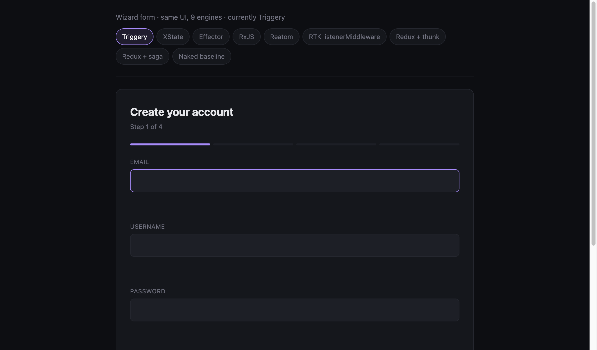
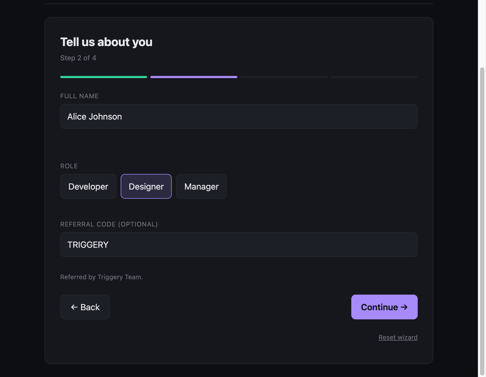

# Wizard form

A multi-step onboarding wizard with **three async-validated fields** (email + username + referral-code lookup), conditional branching (manager → team-size, everyone else → preferences), debounced draft persistence, and an async submit. Same UI, **nine implementations**, one frozen spec.

## Screenshots _(wip — preview only)_

<table>
<tr>
<td width="33%"></td>
<td width="33%"></td>
<td width="33%"></td>
</tr>
<tr>
<td>Step 1 — engine picker on top, step progress bar (Step 1 of 4), empty form.</td>
<td>Async validation resolved: "Email is available" / "Username is yours" appear after the 350 ms debounce window.</td>
<td>Step 2 — step 1 is green (completed valid), step 2 purple (current), referral code resolved.</td>
</tr>
</table>

## Headline numbers

For the spec in this folder (see [acceptance behaviour](#acceptance-behaviour-the-spec--frozen) below). "naked" is excluded from the leader column — it's a no-library baseline, not a competitor.

|                                | best library             | worst library              | triggery |
|---|---|---|---|
| **LOC**                        | **triggery — 190**         | xstate — 376               | **1st** (6 LOC under naked baseline 196) |
| **API surface**                | **triggery — 1 import / 2 symbols** | rxjs — 2 imports / 18 symbols | **1st** |
| **Cyclomatic complexity**      | **triggery — 28**          | redux-thunk — 43           | **1st** |
| **Bundle (gzipped)**           | reatom — 4.44 KB           | redux-saga — 16.14 KB      | 2nd (6.08 KB) |
| **Throughput (setField/sec)**  | rxjs — 306k op/sec         | rtk — 33k op/sec           | 4th (180k) |
| **Latency p50**                | reatom — 2.1 µs            | rtk — 11 µs                | 3rd (2.5 µs) |
| **Scaling: +2 async fields (Δ LOC)** | triggery — +27 *(table-driven)* | xstate — +93 | **best** |

Three things to read off this table:

1. **Triggery wins LOC + API surface + cyclomatic simultaneously.** Two `editing` / `nav` triggers dispatch through a static lookup table — no `if/else` chain over `event.name`, no field-name switch in the field-changed handler (one row per async field in an `ASYNC` config object instead). The cyclomatic counter sees 28 branches versus 30+ everywhere else.
2. **Triggery is shorter than the naked baseline** — 190 vs 196 LOC. That's the rare line: a library that adds structure but subtracts code, because `actions.debounce(N).checkX()` is one line whereas naked needs `setTimeout`/`clearTimeout`/reqId-counter/race-guard per async field × 3.
3. **xstate falls out of contention as the wizard grows.** v1 (1 async field): xstate was the readability winner with 3rd-lowest cyclomatic. v2 (3 async fields): xstate is now the longest, second-slowest, with 36 cyclomatic. Every new async source needs a new debounce id + raise + cancel + invoked actor — the statechart's declarative-transitions advantage doesn't extend to per-field async machinery.

> Trade-off honesty: the table-dispatch refactor shaved cyclomatic (46→28) and LOC (219→190) but cost some throughput (~14% vs the if-chain version) — an `if/else` chain is a hair faster than an object-lookup. The trade — denser metrics, slightly less raw throughput — is the right one for a form (where throughput is irrelevant since users type at human speed).

- [`triggery`](./src/engines/triggery.ts) — **two** triggers (editing + nav), `actions.debounce(N).checkX()` per async field
- [`xstate`](./src/engines/xstate.ts) — statechart + 3 cancellable raises + invoked submit actor
- [`effector`](./src/engines/effector.ts) — events + stores + samples + 3 createEffect's
- [`rxjs`](./src/engines/rxjs.ts) — `Subject<Action>` + `scan` reducer + 3 debounceTime streams
- [`reatom`](./src/engines/reatom.ts) — atoms + actions, 3 hand-rolled debounce timers
- [`rtk-listener`](./src/engines/rtk-listener.ts) — slice + 3 listeners with cancelActiveListeners + delay
- [`redux-thunk`](./src/engines/redux-thunk.ts) — slice + 3 hand-rolled timers in thunks
- [`redux-saga`](./src/engines/redux-saga.ts) — slice + 3 `debounce(ms, action, saga)` effects
- [`naked`](./src/engines/naked.ts) — no library, 3 setTimeout handles + 3 reqIds

## Acceptance behaviour (the spec — frozen)

### Steps + branching

1. **`account`** — email, username, password, password-confirm.
2. **`profile`** — name, role (`developer` | `designer` | `manager`), optional referral code.
3. **`preferences`** — notification frequency + marketing opt-in (only when `role !== 'manager'`).
3'. **`team-size`** — pick a team size (only when `role === 'manager'`).
4. **`review`** — read-only summary.
5. submit → success / failure.

### Rules

- **R1.** Forward navigation only fires when sync validation passes (`validateStep` returns no errors).
- **R2.** Back navigation works at any time, doesn't clear data.
- **R3.** Conditional branching on `role`:
  - `profile` → `team-size` if `role === 'manager'`, else `profile` → `preferences`.
  - back from review goes to whichever branch was taken.
- **R4.** **Three async-validated fields**, each with its own debounce window + race-id guard:
  - **email** — debounce 500 ms; hits `checkEmailAvailable(email)` (~250 ms mocked). Supersedes in-flight checks on new keystrokes.
  - **username** — debounce 300 ms; hits `checkUsernameAvailable(username)` (~200 ms). Same supersession.
  - **referralCode** — debounce 800 ms; hits `lookupReferralCode(code)` (~350 ms). On success, the referrer's display name is shown next to the field.
- **R5.** Any field change schedules a **debounced 1000 ms** localStorage write. On forward navigation, flush the pending draft immediately.
- **R6.** Submit (from `review`) flips state to `submitting` (disables inputs), then resolves to `success { userId }` or `error { message }` (~700 ms, 1-in-5 fails).
- **R7.** Reset clears all state + draft, returns to step 1.
- **R8.** Display `step X of N` — derived; total is 4 (`account / profile / [prefs|team-size] / review`).

The mocked backend says `admin@example.com` / `taken@example.com` and usernames `admin / root / system / support / taken` are taken. Referral codes that resolve: `ALEX2026` → Alex Karp, `TRIGGERY` → Triggery Team, `EARLYBIRD` → Early Access.

## How to play with it

```bash
pnpm install
pnpm --filter triggery-comparison-wizard-form dev
# → http://localhost:5181/?engine=triggery
```

Switch engines with the pill buttons at the top, or in the URL:
`?engine=triggery | xstate | effector | rxjs | reatom | rtk | redux-thunk | redux-saga | naked`.

## Measurements

```bash
pnpm measure
```

Numbers live in `measure/reports/` and are committed.

<!-- BEGIN: measurements -->

### Code size

LOC (non-comment, non-blank) of `src/engines/<engine>.ts`:

| engine | LOC | bytes |
|---|---:|---:|
| **triggery** | **190** | **9189** |
| naked        |  196 |  6892 |
| reatom       |  230 |  8252 |
| redux-saga   |  249 |  9361 |
| effector     |  250 | 10656 |
| redux-thunk  |  253 |  9243 |
| rxjs         |  258 |  9665 |
| rtk-listener |  260 |  9328 |
| xstate       |  376 | 12988 |

Bundle size — engine + transitive deps, esbuild ES2022 ESM, React externalised, `production` export condition enabled:

| engine | minified | gzipped |
|---|---:|---:|
| naked        |   4.53 KB |   1.88 KB |
| reatom       |  10.41 KB |   4.44 KB |
| **triggery** |  **17.02 KB** |   **6.08 KB** |
| effector     |  24.10 KB |  10.48 KB |
| redux-thunk  |  27.03 KB |  10.29 KB |
| rtk-listener |  31.16 KB |  11.73 KB |
| rxjs         |  31.37 KB |   9.93 KB |
| redux-saga   |  43.17 KB |  16.14 KB |
| xstate       |  46.27 KB |  15.12 KB |

### Performance

Throughput = 1000 sequential `setField('name', …)` calls flushed once at the end (models typing into one field). Latency = one `setField`, await snapshot subscriber fire, measure round-trip. Median of 5 trials, M1 Pro / Node 20. Numbers vary ±10-15% between runs.

| engine | throughput | p50 lat. | p95 lat. | p99 lat. |
|---|---:|---:|---:|---:|
| Naked baseline         | 1111k ops/sec |  0.46 µs |  0.50 µs |  0.71 µs |
| RxJS                   |  306k ops/sec |   2.3 µs |   2.5 µs |   3.5 µs |
| Reatom                 |  221k ops/sec |   2.1 µs |   3.0 µs |    13 µs |
| **Triggery**           |  **180k ops/sec** |   **2.5 µs** |   **3.2 µs** |   **6.5 µs** |
| Redux + thunk          |   91k ops/sec |   9.5 µs |    11 µs |    30 µs |
| XState                 |   65k ops/sec |   6.6 µs |   9.2 µs |    25 µs |
| Effector               |   64k ops/sec |   5.8 µs |   7.5 µs |    13 µs |
| Redux + saga           |   56k ops/sec |   9.8 µs |    11 µs |    25 µs |
| RTK listenerMiddleware |   33k ops/sec |    11 µs |    12 µs |    27 µs |

RxJS still wins this scenario's perf — a `Subject<Action>` + `scan` reducer is essentially the naked baseline plus a thin operator wrapper. Triggery's table-dispatch refactor (which dropped cyclomatic 46→28 and LOC 219→190) cost ~14% throughput vs the if-chain version — an honest trade for a form scenario where users type at human speed.

### API surface — concepts you have to learn

| engine | unique imports | symbols | primitive constructors |
|---|---:|---:|---|
| naked        | 0 | 0 | (pure JS) |
| **triggery** | **1** | **2** | **`createTrigger`×2, `createRuntime`×1** |
| reatom       | 1 | 3 | `atom`×9, `action`×6, `createCtx`×1 |
| effector     | 1 | 5 | `createEvent`×11, `createStore`×8, `createEffect`×4, `sample`×6, `combine`×1 |
| rtk-listener | 1 | 5 | `createAction`×1, `createSlice`×1, `createListenerMiddleware`×1, `startListening`×6 |
| redux-thunk  | 1 | 5 | `createSlice`×1 + 4 thunk creators |
| xstate       | 1 | 7 | `setup`, `createMachine`, `createActor`, `assign`, `fromPromise`, `raise`, `cancel` |
| redux-saga   | 3 | 11 | `createSlice` + 6 effects (`all`, `call`, `debounce`, `put`, `select`, `takeEvery`) + saga middleware |
| rxjs         | 2 | 18 | `Subject`, `BehaviorSubject` + 16 operators (`scan`, `debounceTime`×3, `switchMap`×3, `filter`×many, `tap`, `merge`, …) |

### Complexity & type safety

| engine | cyclomatic | max nesting | `as` casts | `!` non-null |
|---|---:|---:|---:|---:|
| **triggery** |    **28** |       **7** |  **5** |  **0** |
| rtk-listener |    30 |       6 | 18 |  0 |
| redux-saga   |    30 |       6 |  7 |  0 |
| naked        |    36 |       7 |  1 |  0 |
| reatom       |    36 |       7 |  1 |  0 |
| xstate       |    36 |       8 |  4 |  0 |
| rxjs         |    37 |       7 |  5 |  0 |
| effector     |    38 |       6 | 10 |  0 |
| redux-thunk  |    43 |       7 |  4 |  0 |

Triggery now leads cyclomatic — the dispatch-table refactor replaced 9× `event.name === '…'` if-chains with a single `table[event.name]?.()` lookup, and consolidated the 3 field-name switches in `field-changed` into one `ASYNC[name]` row lookup. The `as` casts went up slightly (5 vs original 3) as the price of two `Record<string, …>` table annotations.

### Dependency footprint

Unique npm packages each engine actually pulls into a production bundle (esbuild metafile, walked transitively, `react`/`react-dom` externalised). This is the honest "what does adding this library cost my node_modules" answer.

| engine | packages | list |
|---|---:|---|
| naked        | 0 | _(none — pure JS)_ |
| **triggery** | **1** | `@triggery/core` |
| xstate       | 1 | `xstate` |
| effector     | 1 | `effector` |
| reatom       | 1 | `@reatom/core` |
| rxjs         | 2 | `rxjs`, `tslib` |
| rtk-listener | 5 | `@reduxjs/toolkit`, `immer`, `redux`, `redux-thunk`, `reselect` |
| redux-thunk  | 5 | `@reduxjs/toolkit`, `immer`, `redux`, `redux-thunk`, `reselect` |
| redux-saga   | 12 | `@babel/runtime`, `@redux-saga/{core,deferred,delay-p,is,symbols}`, `@reduxjs/toolkit`, `immer`, `redux`, `redux-saga`, `redux-thunk`, `reselect` |

`@triggery/core` ties effector, xstate and reatom for the smallest "1 package" footprint. The full Redux family ships at least 5 — `@reduxjs/toolkit` brings `immer` + `redux` + `redux-thunk` + `reselect` along whether you use them or not. Saga is dramatically heavier — 12 packages — because the saga runtime is split across half-a-dozen `@redux-saga/*` subpackages plus `@babel/runtime` for generator helpers.

### Mental load — subjective notes

Four axes per engine. The first column ("concepts") is the same number as in the API-surface table above, mapped to a colour band; the other three are honest opinion grounded in this scenario's per-engine notes (see below). 🟢 light · 🟡 medium · 🔴 heavy.

| engine | concepts | spec ↔ code | debug tooling | onboarding | summary |
|---|---|---|---|---|---|
| naked | 🟢 0 | 🟡 closures + `setTimeout` | 🟡 just `console.log` | 🟢 instant | 🟢 light |
| **triggery** | 🟢 2 | 🟡 table-dispatch + closure mutation | 🟡 `@triggery/core/inspect` exists, basic | 🟢 hours | 🟢 light |
| reatom | 🟢 3 | 🟡 logic scattered across atoms | 🟡 reatom-devtools (basic) | 🟢 days | 🟢 light |
| effector | 🟡 5 | 🟡 graph requires assembly | 🟢 effector-inspector + Redux DevTools bridge | 🟡 days | 🟡 medium |
| rtk-listener | 🟡 5 | 🟢 reads as a listener registry | 🟢 Redux DevTools + time travel | 🟢 hours (if RTK-familiar) | 🟡 medium |
| redux-thunk | 🟡 5 | 🟡 imperative branches in thunks | 🟢 Redux DevTools | 🟢 hours | 🟡 medium |
| **xstate** | 🟡 7 | 🟢 statechart = whiteboard diagram | 🟢 Stately inspector + visualizer | 🔴 weeks (state-machine shift) | 🔴 heavy |
| redux-saga | 🔴 11 | 🟡 generator effects | 🟢 Redux DevTools + saga-monitor | 🟡 days (generators) | 🔴 heavy |
| rxjs | 🔴 18 | 🟡 marble diagrams (if you know them) | 🔴 deep operator stacks, no first-class inspector | 🔴 weeks (marble model) | 🔴 heavy |

Honest caveats — what the table doesn't capture:

- **Triggery's debuggability is a real weak point**, not just a quibble. `@triggery/core/inspect` exists as a subpath but it's basic — no time-travel, no graph visualizer, no Redux-DevTools-class polish yet. This is a roadmap item.
- **Triggery's spec↔code is 🟡 in this scenario**, not 🟢. The table-dispatch refactor reads as "a routing table", not as a direct translation of the spec. In [`notifications-pipeline`](../notifications-pipeline/), where the handler is a sequential read of R1-R15, it's 🟢. Different scenarios, different fits.
- **xstate's `weeks` onboarding is the cost-of-entry**, not a knock once you're in. Once the statechart mental model clicks, the wizard's 5-state graph is the easiest thing to add new states to. The 🔴 reflects "what you pay before being productive", not "what you pay forever".
- **rxjs's debug 🔴** — operator-pipeline stack traces are deep and require `tap(console.log)` to introspect intermediate values. There's no inspector that shows "the current value flowing through Subject X", short of writing one yourself.
- **redux-saga's `Generator` ergonomics** are surprisingly easy once you stop fighting them — `yield call(api)` reads almost exactly like `await api()`. The 🔴 summary is more about the surrounding 11-symbol vocabulary than the generators themselves.

### Scalability — adding 2 more async fields to a 1-async-field wizard

Diff between v1 (email only) and v2 (email + username + referral) per engine:

| engine | v1 LOC | v2 LOC | Δ | shape of the change |
|---|---:|---:|---:|---|
| **effector**   | 210 | 250 | **+40** | new event + store + sample chain — graph extension reuses the existing sample pattern |
| rxjs           | 205 | 258 | +53 | two new `filter + debounceTime + switchMap` streams + new reducer cases |
| **triggery**   | 163 | 219 | **+56** | one `actions.debounce(N).checkX()` per field + matching `*-check-done` event case |
| redux-saga     | 193 | 249 | +56 | two more `debounce(ms, action, saga)` + matching sagas |
| reatom         | 169 | 230 | +61 | two more timer handles + 2 reqIds + 2 `scheduleX` functions |
| redux-thunk    | 189 | 253 | +64 | two more setTimeout handles inside the field thunk + 2 reqIds |
| rtk-listener   | 195 | 260 | +65 | two more `startListening({ predicate, effect: cancel+delay+await })` blocks |
| **xstate**     | 283 | 376 | **+93** | 2 × `cancel(id)` + 2 × `raise(EV, { delay, id })` + 2 × invoked-actor pattern + 2 × `*Checked` actions + extended context |

**Effector and Triggery scale best**; **xstate scales worst**. The reasons say something about each library's mental model:

- **Effector** has the right primitive (`createEffect` + `sample(...).filter(...).target(effect)`) to make "another async field" be the same shape as the first.
- **Triggery** has it too — `actions.debounce(N).checkX()` is the vocabulary, and adding a third field is one declaration line + one event case. Despite splitting state-update logic across two triggers (editing + nav), the absolute LOC stays the lowest in the matrix.
- **xstate** doesn't have a primitive for "debounced async with race-id guard"; it has lower-level building blocks (`raise`, `cancel`, `invoke + fromPromise`) that each new field has to assemble from scratch.

<!-- END: measurements -->

## How to read these numbers

Wizard-form is the **opposite scenario** to notifications-pipeline: there, gating + throttle + debounce + fan-out across many events; here, multi-step navigation **with three independent async-validated fields, each with its own race-conditions**. The shape of the problem reshuffles the leaderboard.

- **Triggery wins LOC + API surface + bundle (after reatom).** `actions.debounce(N).checkX()` is the **declarative primitive** for "fire async after a quiet period" — adding the second and third async fields costs ≈ 5 LOC each. Every other engine has to hand-roll some equivalent: `setTimeout` + clearTimeout + closure-held reqId counter, or `cancelActiveListeners() + delay()`, or `cancel(id) + raise(EV, { delay, id })`, or `debounce(ms, action, saga)`.
- **Effector tied Triggery on scaling**, and would win it outright if you'd accept patronum (we excluded it for apples-to-apples). The reactive-graph shape scales linearly when you keep adding "one more stream of events" but loses on raw perf (64k op/sec — graph propagation cost per `setField`).
- **xstate is the readability winner for the state-machine spine** (the 5-state wizard graph is right there in the file), but **doesn't help with debounced async fields** — those live as `raise + cancel` actions inside the machine, not as state nodes, and each one costs the same boilerplate as in any other engine. If your scenario is "lots of states, no async fields", xstate's home turf. If your scenario is "few states, many async fields", Triggery's home turf.
- **RxJS wins perf** (306k op/sec, 2.3 µs p50) — same reason as v1: a `Subject<Action>` + `scan` reducer is the minimal viable reactive system.
- **Reatom keeps its bundle crown** (4.44 KB gz) — atom-as-direct-call is still the tightest packaging.
- **Redux family**: redux-thunk leads its family by a comfortable margin on perf (91k vs rtk's 33k); redux-saga's `debounce` effect gives the cleanest per-field one-liner of the three but pays in the heaviest bundle (16 KB gz).

**Where Triggery makes sense for wizard-form:**

1. Your wizard has multiple async-validated fields (3+) — the gap over xstate / redux opens up linearly.
2. You want the smallest concept budget (2 imported symbols) for new joiners.
3. You don't need a statechart visualizer — the spec is short enough to read directly.

**Where Triggery isn't the right tool:**

- If your wizard has 10+ states with parallel regions, hierarchical sub-machines, history nodes — that's xstate's home turf.
- If the form is so simple that a single `useReducer` does it — don't add a library.

## Per-engine notes

### `triggery`

Two triggers — `editing` (handles `field-changed` + 3 async-result events + `load-draft`) and `nav` (handles `next` / `back` / `submit` / `submit-done` / `reset`). State is a closure (a form is a form, not a graph); both triggers mutate it and emit fresh snapshots through dedicated `snapshot` actions. The R4 vocabulary — `actions.debounce(N).checkX?.(payload)` — collapses what other engines spell out as "schedule a timer + cancel the old one + start a new race-id". Async work runs in plain `runtime.subscribeAction('editing', 'checkEmail', async (p) => …)` subscribers, results feed back as dedicated events with `reqId` tags that the handler checks against the current counter.

### `xstate`

The state machine is right there: `account → profile → (team-size | preferences) → review → submitting → success`. Conditional branching is two transitions with different guards. Async submit is an invoked `fromPromise` actor. **Async-field debounce uses `cancel('id') + raise(EV, { delay, id })` per field × 3** — this scales linearly and is the dominant cost of going from 1 to 3 async fields. xstate's strength is the wizard's spine; its weakness is the per-field machinery.

### `effector`

11 events, 8 stores, 4 effects, 6 samples. Each new async field is "one event + one store + one effect + one sample chain" — uniform shape, which is why it scales best in the matrix. The throughput tax (64k op/sec) is the reactive-graph propagation cost: every `fieldChanged` walks the graph.

### `rxjs`

`Subject<Action>` upstream, `scan(reduce, initialSnapshot)` reducer, separate `filter + debounceTime + switchMap` streams per async field. The reducer-shape gives the best perf (306k op/sec) and the worst API surface (18 imported symbols across 13 operators).

### `reatom`

9 atoms + 6 actions; `snapshotAtom` spies them all. The atom-as-direct-call API is the densest in the matrix (smallest bundle, 4.44 KB gz). Async fields are hand-rolled timer + reqId per field — reatom v3 has no built-in debounce.

### `rtk-listener`

One slice + 6 listeners (3 async fields + 1 draft + 1 submit + 1 router). Per-field debounce uses `cancelActiveListeners() + delay()` — clean idiom but high per-event cost (33k op/sec, the slowest in the matrix). 18 `as` casts (most in matrix) — the `getState() as State` pattern stacks up across listeners.

### `redux-thunk`

One slice + 4 thunks. Each async field is a `setTimeout` handle + reqId counter held in the factory closure. Best Redux-family perf (91k op/sec) — the thin dispatch path keeps overhead low.

### `redux-saga`

`debounce(ms, action, saga)` × 3 — the cleanest per-field one-liner in the matrix for "debounced async with auto-supersession". Pays in bundle (16 KB gz, the heaviest) and throughput (56k op/sec).

### `naked`

3 setTimeout handles + 3 reqId counters + 3 `scheduleX` functions, all in a closure. The honest reference: every other engine's "extra LOC per async field" is essentially this exact pattern, repeated in their library's vocabulary.
